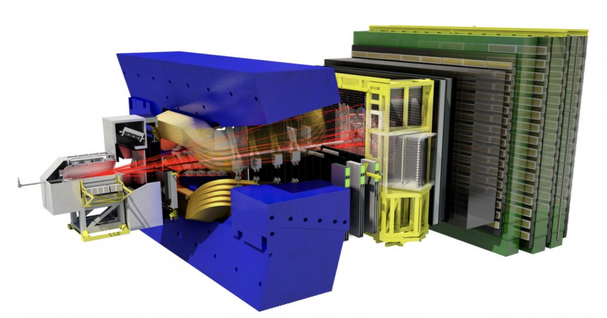

```mermaid
flowchart TD
    
    subgraph "Phase II: 02/2025-12/2025"
    D["S vs B: Multivariate Classifier 🔄 '16"]
    D --> E["Mass Fit to obtain S yield and Extraction of branching ratio"]
    E --> F["Systematic Uncertainties"]
    end
    
    style D fill:#e6f3ff,stroke:#4da6ff
```

#  $\mathcal{B}$ (**$\Lambda^{0}_{b} \rightarrow \Lambda \gamma$**)               
# Branching Ratio Measurement with LHCb Run 2 Data

### **Uzziel Perez** on behalf of
Alèxia Martorell I Granollers, Míriam Calvo Gómez (PI)

### CAL Snapshot (March 13, 2025)

  

    

      
    

    

      
    

  

---
layout: two-cols
---

# Why **$\Lambda^{0}_{b} \rightarrow \Lambda \gamma$**?            

Decay is a  $b \rightarrow s \gamma$ transition (FCNC)
- Forbiddent at tree-level in the SM
- Sensitive to new particles in the loop
- Precise measurement of $\mathcal{B}$ $\rightarrow$ constrain QCD models:
    *  Light Cone Sum Rules (LCSR)
    *  Quark Models (QM)
    *  Heavy Quark Symmetry (HQS)
  

**GOAL ⚽❗** $\rightarrow$ update $\mathcal{B}$:
  * LHCb Run2 data: '16, '17, '18
  * Normalization Mode: $B^{0} \rightarrow K^{*} \gamma$

::right::

  

In contact with previous analyzers and working with Run 3 folks (Arantza, Volodymyr, Jiahui)  on the same $\Lambda^{0}_{b} \rightarrow \Lambda \gamma$ radiative decay.

* **Search for $\Lambda^{0}_{b} \rightarrow \Lambda \gamma$ at LHCb**:  
   LHCb-ANA-2018-033, PhysRevLett.123.031801 (C. Marin, A. Puig)
* **Measurement of the photon polarization in $\Lambda^{0}_{b} \rightarrow \Lambda \gamma$ decays**: 
 LHCb-ANA-020-066, PhysRevD.105.L051104 (LuisMi Garcia Martin, P.G. Gironell, B.K. Jashal, C. Marin, A. Oyanguren)
 

<SlideCurrentNo class="text-orange-400" />
---
layout: fact
---

## **First Observation: $\Lambda^{0}_{b} \rightarrow \Lambda \gamma$**
LHCb 2016 data published in PhysRevLett.123.031801 ([*arXiv:1904.06697*]((arXiv:1904.06697)))

  

$\mathcal{B}(\Lambda^{0}_{b} \rightarrow \Lambda \gamma) = (7.1 \pm 1.5 \, \textrm{(stat)} \pm 0.9 \, \textrm{(syst)}) \times 10^{-6}$ 

<SlideCurrentNo class="text-orange-400" />

---
layout: two-cols
---

## **Samples**

Data and MC samples used for this analysis were inherited from analyzers of 
 **Measurement of the photon polarization in $\Lambda^{0}_{b} \rightarrow \Lambda \gamma$ decays** (*PhysRevD.105.L051104*). 

**Data samples**

  

Stripping and DaVinci versions used to build the candidates are listed in the table above.

::right::

**MC samples**

  

<!-- The simulation samples with the event type, year, simulation version, number of simulated events and the DaVinci version to build the samples are listed in the table above.  -->

**Control Modes:** 
* $\Lambda^{0}_{b} \rightarrow \Lambda J/\Psi, \rightarrow pK^{-} J/\Psi, \rightarrow \Lambda \eta$
<!-- * $\Lambda^{0}_{b} \rightarrow pK^{-} J\Psi$
* $\Lambda^{0}_{b} \rightarrow \Lambda \eta$ -->

**Normalization Mode:** $B^{0} \rightarrow K^{*} \gamma$ (check if another normalization mode is better), e.g. $\Lambda_b^{0} \rightarrow J/\Psi \Lambda$ 

<SlideCurrentNo class="text-orange-400" />

---
layout: two-cols
---

#  **Analysis Pipeline**

Many thanks to the previous analyzers **$\Lambda^{0}_{b} \rightarrow \Lambda \gamma$** for their well-documented code and data!

```mermaid
flowchart TD
    subgraph "Phase I: 10/2024-01/2025"
    A["Trigger ✅ '16, '17, '18"] --> B["Preselection ✅ '16, '17, '18"]
    B --> C["MC Corrections Lb2pkJpsi ✅ '16, '17, '18"]
    end
    
    style A fill:#d4f7d4,stroke:#82d282
    style B fill:#d4f7d4,stroke:#82d282
    style C fill:#d4f7d4,stroke:#82d282
```

::right:: 

<SlideCurrentNo class="text-orange-400" />
---
layout: two-cols
---

#  **Current status**
* Analysis note started within the group with progress up to MC corrections with control mode $\Lambda^{0}_{b} \rightarrow pK^{-} J/\Psi$

<!-- 

  

 -->

  

::right::
<!-- * We are currently preparing the BDT with `XGBoost` algorithm to further separate Signal from Background. -->

  

<SlideCurrentNo class="text-orange-400" />

---
layout: two-cols
---

#  **First Attempt at S vs B: Classifier with XGBoost**
*Work-in-progress...* 🔄 MC Corrections to be applied to SIG
* **BKG**: Data High-mass sideband ($m > 6100$ MeV)
* **SIG**: $\Lambda^{0}_{b} \rightarrow \Lambda \gamma$ (2016) with ($\Lambda^{0}_{b} p, \Lambda^{0}_{b} p_T$) 2D corrections from $\Lambda^{0}_{b} \rightarrow p K^{-} J/\Psi$ control mode 

  

::right::
🔄 First test of BDT S vs B classifier (w/o MC corrections) $\rightarrow$ most discriminative features

  

<SlideCurrentNo class="text-orange-400" />

---
layout: two-cols
---

#  **Reviving the XGBoost Pipeline**
No innovation done here yet. 
* ✅ MC Corrections "applied" to SIG
* 🔄 Slight overtraining/overfitting seen with Train ROC AUC = 0.99 > Test ROC AUC = 0.97
with training score close to 1 and cross-validation much less.
* 🔄 Split data into A and B sets and each of them into Train and Test sets. Train on A set. Apply BDT on B.
* 🔄 Remove redundant features - **recursive feature elimination** 

::right::
* $\rightarrow$ 🔄 Optimize Hyperparameters and Figure of Merit (FOM) 

  

<SlideCurrentNo class="text-orange-400" />

---
layout: default
---

## **Codebase**
We inherited well-documented and clean code 👏 💻 

Our new codebase for [Run2](https://gitlab.cern.ch/lasalle/rad-lb02lbgammabr-obs/lb02lbgammabr) is based on the [Run1](https://gitlab.cern.ch/lasalle/rad-lb02lbgammabr-obs/lb02lbgammabr-obs) one and includes:
* ✅ Python2 to Python3-converted scripts 
* ✅ Updated and self-contained PyLHCb packages (no need to worry about lb-env breaking our code)
* ✅ Useful commands list (see video)
* ✅ Snakefile instead of Makefile (see video)
* ✅ Listed locations of data and MC

Feel free to repurpose our code and send merge requests to clean, improve the analysis codebase. 

Don't forget to document! 

<SlideCurrentNo class="text-orange-400" />

---
layout: two-cols
---
# **Summary and Next Steps**

* Revived pipeline up to **Splots/MC Corr**  and BDT training 
* Currently at reviving the rest of the pipeline for 2016 and later apply it to 2017 and 2018 data
* Happy to collaborate on physics and coding 

::right::

  

<SlideCurrentNo class="text-orange-400" />
---
layout: fact
---

## **Thanks!**

<!-- 

  

 -->

  

    
  

## **¡Gracias!**

<SlideCurrentNo class="text-orange-400" />

---
layout: fact
---

## **BACKUP**

<!-- 

  

 -->

  

    
  

