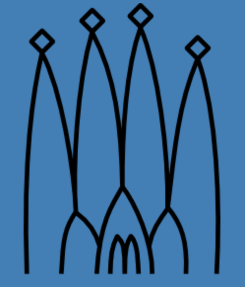
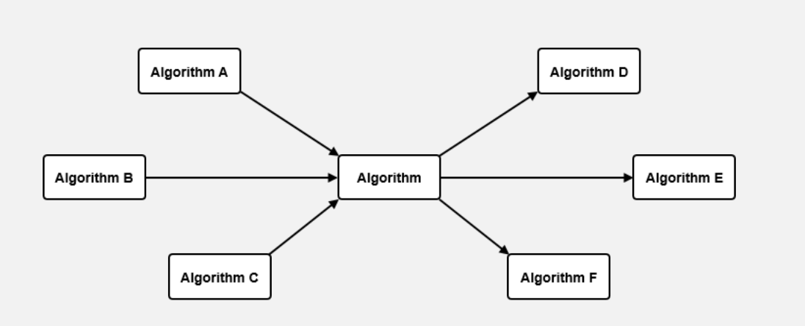
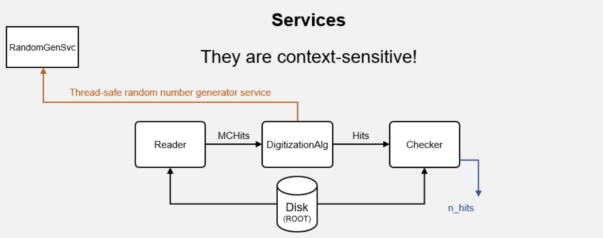
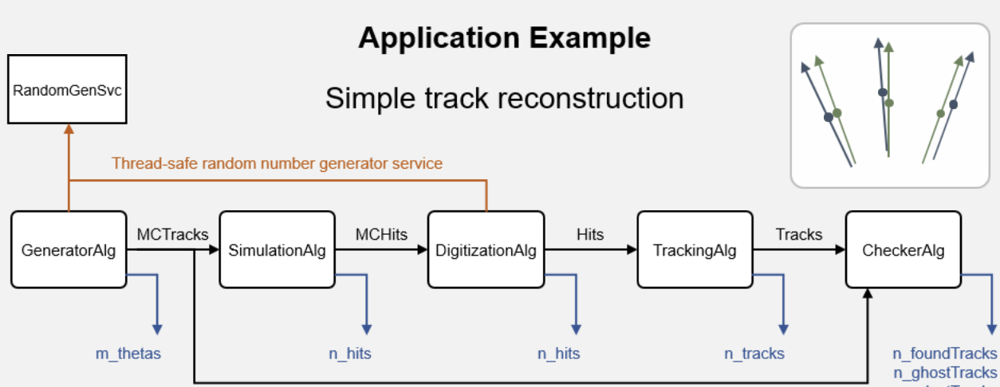
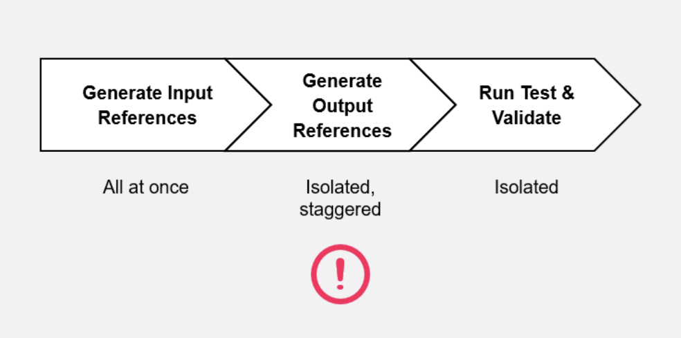
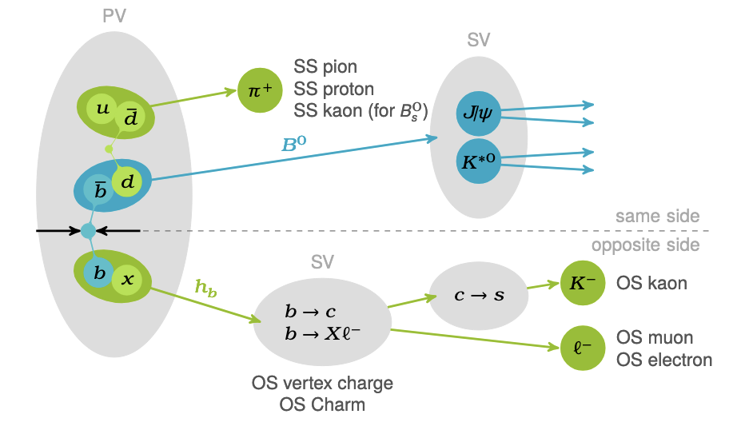
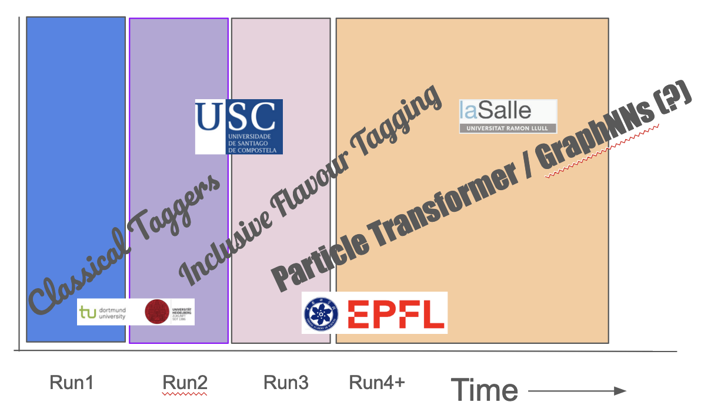
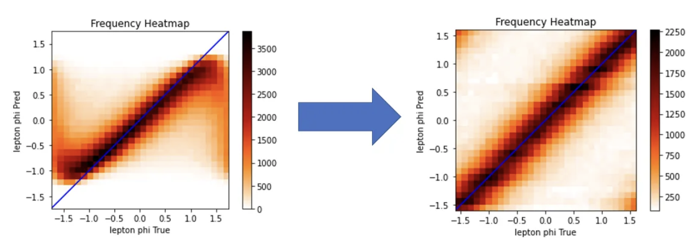
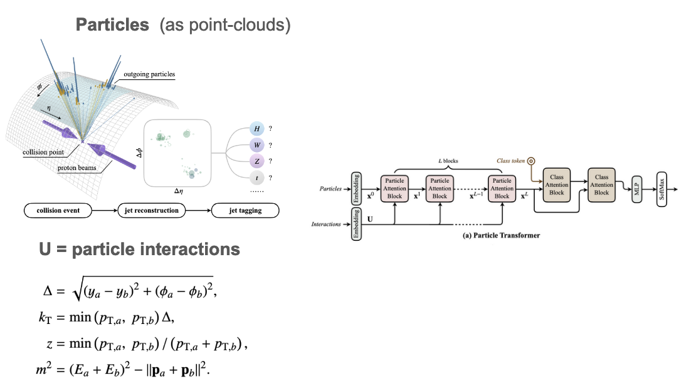

# **LHCb Software Contributions**

# LaSalle Campus Group

## **Dr. Uzziel Perez** on behalf of the La Salle Group

 
**Borja Sevilla SanJuan**, **Pol Muñoz Pastor** 

PIs: Miriam Calvo Gomez, Xavier Vilasis Cardona 

### LHCb Spain
January 10, 2025

---
layout: image-right
image: ./resources/bash/monochrome_light.png
backgroundSize: contain
---

# **Outline**

- Towards Unit Testing in Gaudi 
- Flavour Tagging 
- Reconstruction and Photon PID 

---
layout: fact
---

## **Towards Unit Testing in Gaudi**

  

Contact Person: Pol Muñoz Pastor

<!--  -->

<!--  -->

---
layout: full
---

#  **Problem and Context**

* Complexity of Dependencies: Isolating components is challenging due to interdependencies 

  

* Services are context-sensitive (e.g. Digitization Algorithm - Hits count)

<!-- 

  

 -->

  

---
layout: full
---

#  **Generating Unit tests from Integration Tests**

* Around ~300 integration tests in Gaudi run in nightly builds (once per day) and continuous integration pipeline (once per push)

  

* Approach: "Isolate" an algorithm and test with a generic reader and checker

  

---
layout: full
---

#  **Tasks**

* **O1: Build Generic Tools for Unit Tests** (CURRENT)

  

* **O2: Analyse and Simplify Tests**  such as removing redundant tests, analysing code coverage 

  

* **O3: Study the Impact** of simplication on sustainability (ecological and technical, i.e. resource usage)

  

---
layout: fact
---

## **Flavour Tagging**

<!-- 

  

 -->

  

    
  

Contact Person: Borja Sevilla SanJuan

---
layout: full
---

# **Flavour Tagging Collaboration Landscape**

   - Classical Taggers and Performance for Run3 
   - Inclusive Flavour Tagging with DeepSetNN
   - Additional ideas: Particle Transformer, GraphNNs 

   

  

    
  

---
layout: full
---

# **Tasks**

   - **O1**: Preselection studies to optimize bandwidth  (event rate x event size) while maintaining or improving performance

   - **O2**: Exploring Physics-informed Loss Functions (see [proof-of-concept](https://medium.com/@eric0reinhardt/gsoc-2023-with-ml4sci-reconstruction-and-classification-of-particle-collisions-with-masked-bab8b38958df)) 
      
      - Model must respect known physics constraints such as charge/energy conservation  
      - Add regularization term to the loss function that penalizes deviations from these physics conservation laws

   
   

  

    
  

   - **O3**: Proof-of-Concept for Particle Transformer/ Proto-Foundation Model and/or Graph Neural Networks

---
layout: full
---

# **Tasks: Research Bets**

   - **O3**: Explore the following **moonshot** ideas: 
      - Particle Transformer (ParT), proto-foundation Model, GraphNN 
         - [Particle Transformer for Jet Tagging](https://arxiv.org/pdf/2202.03772), and [ABCNet: an attention-based method for particle tagging](https://link.springer.com/article/10.1140/epjp/s13360-020-00497-3)
         <!-- - OMNIJET-$\alpha$: The first-cross-task foundation model for particle physics -->
      
         - ParT can also be viewed as a graph neural network on a fully-connected graph (each node = particle, each edge = particle interaction)

  

    
  

---
layout: fact
---

## **Simulation and Reconstruction**

<!-- 

  

 -->

  

    
  

Contact Person: Uzziel Perez and Miriam Calvo Gomez 

---
layout: full
---

# Photon PID and Particle Reconstruction

   - Photon PID (Internal Note being written up by Miriam)
   - HYBRID MC and 3X3 Graph Clustering (with Nuria) Integration to LHCb Framework  https://codimd.web.cern.ch/HJ-VpNcrQZy1_yLKz7ifoQ#
   -  Initial work done by.. GraphKANs or Attention Mechanism and Physics Informed loss function[https://indico.cern.ch/event/1470949/contributions/6216436/attachments/2961236/5208399/241105_ECAL_Upgrade.pdf]
   
---
layout: full
---

# Why bet on GraphKANs+Attention Networks?

Potential Upsides
- https://arxiv.org/pdf/2406.13597
MLPs and fixed activation functions impede feature extraction due to information loss. 
- better expressive power in representation learning compared to original graph networks 
- GraphKANs use attention mechanisms to focus on the most relevant relationships in the data reducing computational overhead by ignoring less important interactions
=GraphKANs leverage graph kernels to encode structural information more effectively, potentially capturing particle interaction patterns more efficiently than simpler clustering methods like 3x3 clustering
Potential Downsides..
- must check latentcy requirements.. i.e. demonstrate lower latency
-The computational cost of the attention mechanism and kernel computations in GraphKANs must be benchmarked against existing methods.

To determine whether GraphKANs are truly viable for HLT1:

    Benchmarking: Compare the speed and accuracy of GraphKANs against 3x3 clustering and GraphNNs under HLT1-like conditions.
    Optimizations: Explore hardware acceleration (e.g., GPUs/TPUs) and algorithmic optimizations for GraphKANs.
    Integration: Assess how well GraphKANs integrate with existing HLT1 pipelines.

GraphKANs offer a promising middle ground between the simplicity of 3x3 clustering and the complexity of GraphNNs. Their potential for time efficiency and selective focus on relevant data could make them suitable for HLT1 particle reconstruction. However, rigorous testing and optimization are necessary to ensure they meet the stringent requirements of HLT1 systems.

---
layout: fact
---

---
layout: full
---

# Why bet on Transformers and GraphNNs?

   - GraphKAN 
   - MOONSHOTS: proto foundation model for flavour tagging.. 2-step process where we create a backbone model through unsupervised learning and do a particular downstream task.. OS Tagging or SS tagging for instance.
