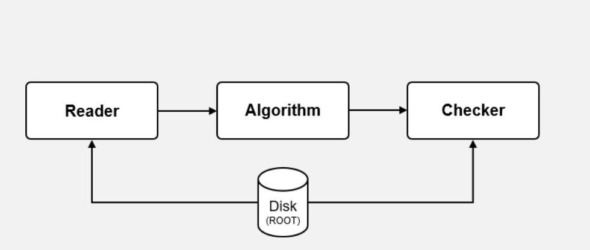

# **LHCb Software Contributions**

# LaSalle Campus Group

## **Dr. Uzziel Perez** on behalf of 
 
**Borja Sevilla SanJuan**, **Pol Muñoz Pastor** (Adviser: Eduard Fernandez Alonso) 

PIs: Miriam Calvo Gomez, Xavier Vilasis Cardona

### LHCb Spain
January 9, 2025

<!-- 

  

 -->

  

    

      
    

    

      
    

  

<!-- 

  

    
  

  

    
  

 -->

---
layout: image-right
image: ./resources/lasalleSoftware/LHCb.png
backgroundSize: contain
---

# **Outline**

Multi-headed effort in Software: 

- Towards Unit Testing in Gaudi 
- Flavour Tagging 
- Reconstruction and Photon PID 

  

  

<SlideCurrentNo class="text-orange-400" />
---
layout: fact
---

## **Towards Unit Testing in Gaudi**

  

Contact Person: Pol Muñoz Pastor

<SlideCurrentNo class="text-orange-400" />
<!--  -->

<!--  -->
---
layout: full
---

#  **Problem and Context**

* Complexity of Dependencies: Isolating components is challenging due to interdependencies 

  

* Services are context-sensitive (e.g. Digitization vs Reconstruction Algorithm - diff. counters)

<!-- 

  

 -->

  

<SlideCurrentNo class="text-orange-400" />
---
layout: full
---

#  **Generating Unit tests from Integration Tests**

* Around ~300 integration tests in Gaudi run in nightly builds (once per day) and continuous integration pipeline (once per push)

  

* Approach: "Isolate" an algorithm and test with a generic reader and checker

  

<SlideCurrentNo class="text-orange-400" />
---
layout: full
---

#  **Tasks**

* **O1: Build Generic Tools for Unit Tests** (CURRENT)

  

* **O2: Analyse and Simplify Tests**  such as removing redundant tests, analysing code coverage 

  

* **O3: Study the Impact** of simplication on sustainability (ecological and technical, i.e. resource usage)

<!-- 

  

<SlideCurrentNo class="text-orange-400" /> -->

<SlideCurrentNo class="text-orange-400" />

---
layout: fact
---

## **Flavour Tagging**

<!-- 

  

 -->

  

    
  

Contact Person: Borja Sevilla SanJuan

<SlideCurrentNo class="text-orange-400" />/ <SlidesTotal class="text-orange-400"/>
---
layout: full
---

# **Flavour Tagging Collaboration Landscape**

   - Classical Taggers and Performance for Run3 
   - Inclusive Flavour Tagging with DeepSetNN
   - Additional ideas: Particle Transformer, GraphNNs 

   

  

    
  

<SlideCurrentNo class="text-orange-400" />
---
layout: full
---

# **Tasks**

   - **O1**: Preselection studies (Classical) to optimize bandwidth (event rate x event size) while maintaining or improving performance

   - **O2**: Exploring Physics-informed Loss Functions (see [proof-of-concept](https://medium.com/@eric0reinhardt/gsoc-2023-with-ml4sci-reconstruction-and-classification-of-particle-collisions-with-masked-bab8b38958df)) 
      
      - Model must respect known physics constraints such as charge/energy conservation  
      - Add regularization term to the loss function that penalizes deviations from these physics conservation laws

   
   

  

    
  

   - **O3**: Proof-of-Concept for Particle Transformer/ Proto-Foundation Model and/or Graph Neural Networks
<SlideCurrentNo class="text-orange-400" />

---
layout: image-right
image: ./resources/lasalleSoftware/FTinnov.png
backgroundSize: contain
---

# **Tasks: Research Bets**
**O3**: Explore the following **moonshot** ideas inspired by industry developments: 
  - Particle Transformer ([ParT](https://arxiv.org/pdf/2202.03772))
    - Fully-connected graph where each node $\rightarrow$ particle, edge $\rightarrow$ U
    - Performs better than vanilla transformer
    
  - State Space Model ([MAMBA](https://arxiv.org/pdf/2312.00752))
    - is found to be more efficient and has 5X higher throughput than Transformers

  -  "**Point clouds**" (unordered set of variables in high-dim space) represent charged tracks, vertices, particles in each event

<SlideCurrentNo class="text-orange-400" />
<!-- 
  - Particle Transformer (ParT), and State-space models (Mamba) proto-foundation Models
         - [Particle Transformer for Jet Tagging](https://arxiv.org/pdf/2202.03772) and [ABCNet: Attention-Based Method for Particle Tagging](https://link.springer.com/article/10.1140/epjp/s13360-020-00497-3)   -->
<!-- 
      - ParT can also be viewed as a graph neural network on a fully-connected graph 
      - (each node = particle, each edge = particle interaction) -->
    
---
layout: fact
---

## **Simulation, Reconstruction, PID**

<!-- 

  

 -->

  

    
  

Contact Person: Uzziel Perez and Miriam Calvo Gomez 

<SlideCurrentNo class="text-orange-400" />
---
layout: full
---

# **PID, Simulation and Reconstruction Scope**

   - PID Internal Note being written up by Miriam
   - HybridMC for PicoCal and 3X3 Reconstruction integration into LHCb Simulation Framework (w/ Nuria V.C.)
   - Evolving Reconstruction Algorithms for *beyond Run 3* challenges 
      - From Cellular Automaton $\rightarrow$ Graph Clustering $\rightarrow$  **End-to-End Reconstruction with GraphNN variants**
<!-- <SlideCurrentNo class="text-orange-400" /> -->

  

    
  

<SlideCurrentNo class="text-orange-400" />

---
layout: full
---

# **Cluster shapes + Longitudinal Segmentation in PID**
Miriam performed a study to evaluate the benefit of having **longitudinal segmentation for neutral PID**
   - **Longitudinal segmentation** improves discrimination between **electromagnetic and hadronic showers** specially in lower-granularity, outer regions. 
   - Example Energy Depositions for the inner region:

  

    
  

 
<!-- 
<SlideCurrentNo class="text-orange-400" />
 -->
<SlideCurrentNo class="text-orange-400" />

---
layout: image-right
image: ./resources/lasalleSoftware/FrontAndBackPivsGamma.png
backgroundSize: contain
---

# **Particle Gun**
   - $\gamma$s and $\pi^{-}$ generated w/ standalone "Spacal Simulation" 
   (which also includes Shashlike types)
  
   `FullEcalSimulations/Run5_baseline_2023` 
  - ~185k $\gamma$ and ~176k $\pi^{-}$ (uniformly along Calo Plane)
  - Uniformly along the Calorimeter plane
  - E: 0.2, 0.5, 1, 2, 3, 4, 10, 20, 35, 50, 100 GeV
  - Incident Angle: $< 15^{\circ}$
  - Energy distributions along the modules apparent between $\gamma$ and $\pi^{-}$

<SlideCurrentNo class="text-orange-400" />
---
layout: full
---

# Classifier $\gamma$ vs $\pi^{-}$

   - Two classifiers were trained using TMVA per calo region.
      - Classifier A: With longitudinal segmentation - inputs: ($E_i/E_{TOT}$) of 18 cells (front and back) separately + the ratio deposited at the front ($E_{FRONT}/E_{TOT}$)
      - Classifier B: Without longitudinal segmentation - inputs: ($E_i/E_{TOT}$) of the 9 cells where a cell, i = F+B 
  

  

    
  

 

<SlideCurrentNo class="text-orange-400" />
---
layout: full
---

# In favor of longitudinal segmentation

   - Having longitudinal segmentation provides significant improvement on photon PID for all regions particularly for outermost cells (120 mm cell sizes). 
   - The low scenario in the scoping document would degrade the PID capability of PicoCal.
   - Note: This study doesn't include real U2 data-taking conditions i.e. does not include pile-up and timing information. Similar relative improvement is expected.
  

  

    
  

 
<SlideCurrentNo class="text-orange-400" />

---
layout: full
---

# **Evolving Reconstruction Algorithms**
   - **3x3 Graph Clustering**: Default reconstruction algorithm for Run 3 (65\% better than Cellular Automaton in terms of time performance)
   - Graph Neural Networks appear to be natural successors. 
   - Initial studies by Syracuse University group show better energy resolution (Pb modules)
  

  

    
  

 
<SlideCurrentNo class="text-orange-400" />

---
layout: full
---

# **Potential Upsides of GraphNN variants**
Focus: GraphNNs with Attention (GATs) and GATs with Learnable Activations (Ka-GATs) (see "[Design Space for Graph Neural Networks](https://proceedings.neurips.cc/paper/2020/file/c5c3d4fe6b2cc463c7d7ecba17cc9de7-Paper.pdf)")

- Attention mechanism targets relevant clusters and learns important features directly from raw data
- KANs (Kolmogorov-Arnold Networks) learn complex nonlinear relationships between calorimeter hits, irregular detector geometry, pileup, timing, and particle properties (type, energy, momentum).

<!-- 
   - We focus on two prominent variants: GraphNNs with Attention Mechanism (GATs) and GATs with learnable activation functions (Ka-GATs).
   - UPSIDES: 
      - attention mechanism focuses more on relevant clusters and important features are automatically learned from raw data unlike in 3X3 clustering
      - KANs (Kolmogorov-Arnold Networks) are capable of learning highly nonlinear relationships between calorimeter hits, pileup, timing information and particle properties (particle type, energy, momentum...)
      - Scalable: By selectively focusing on the most relevant hits, GraphKANs can efficiently process large volumes of data in real-time (or near-real-time). Their architecture also allows for parallelization, enabling high-throughput processing, which is crucial for handling vast amounts of data in particle reconstruction tasks. -->

  

    
  

 
<SlideCurrentNo class="text-orange-400" />
---
layout: full
---

# **Can we do an End-to-End reconstruction?**
Focus: GraphNNs with Attention (GATs) and GATs with Learnable Activations (Ka-GATs).
  - Total data throughput 32 Tbits/s needs to be reconstructed in real-time. Would selective focus via multi-attention heads on relevant hits help?
  - With KANs, would smaller model sizes lower inference and training times?  KANs are not known to be parallelizable.
  - Can we take full advantage of the GPUs and perform a single reconstruction step by training on full-readout? (See E2E efforts in [CMS](https://indico.cern.ch/event/753914/contributions/3444463/attachments/1884973/3106831/E2E_Usai_Boost19.pdf)). This will entail creating a composite image/graph of multiple detectors. (See [S.Thais et al](https://arxiv.org/pdf/2203.12852) and [M.B.Andrews et al.](https://www.epj-conferences.org/articles/epjconf/abs/2021/05/epjconf_chep2021_03057/epjconf_chep2021_03057.html))
<!-- 
   - We focus on two prominent variants: GraphNNs with Attention Mechanism (GATs) and GATs with learnable activation functions (Ka-GATs).
   - UPSIDES: 
      - attention mechanism focuses more on relevant clusters and important features are automatically learned from raw data unlike in 3X3 clustering
      - KANs (Kolmogorov-Arnold Networks) are capable of learning highly nonlinear relationships between calorimeter hits, pileup, timing information and particle properties (particle type, energy, momentum...)
      - Scalable: By selectively focusing on the most relevant hits, GraphKANs can efficiently process large volumes of data in real-time (or near-real-time). Their architecture also allows for parallelization, enabling high-throughput processing, which is crucial for handling vast amounts of data in particle reconstruction tasks. -->

  

    
  

 

<SlideCurrentNo class="text-orange-400" />
---
layout: image-right
image: ./resources/lasalleSoftware/LaSalle.png
backgroundSize: contain
---

# **Summary**

LaSalle is involved in a multi-headed effort to improve LHCb software from efficient testing, improving flavour tagging algorithms, simulation and reconstruction as well as PIDs. Our research bets involve the following: 

* **Unit Testing in Gaudi**
* **Flavour Tagging** with Physics-informed Loss Functions and Proto-foundation models
* **PIDs** with segmentation and timing information
* Applying Variants of Graph Neural Networks for **Reconstruction**

<SlideCurrentNo class="text-orange-400" />

---
layout: fact
---

## **Thanks!**

<!-- 

  

 -->

  

    
  

## **¡Gracias!**

<SlideCurrentNo class="text-orange-400" />

---
layout: fact
---

## **BACKUP**

<!-- 

  

 -->

  

    
  

---
layout: full
---

# **Foundation Models**

  

    
  

 
<SlideCurrentNo class="text-orange-400" />

---
layout: full
---

# **Backbone**

  

    
  

 

<SlideCurrentNo class="text-orange-400" />

---
layout: full
---

# **Backbone**

  

    
  

 

<SlideCurrentNo class="text-orange-400" />

---
layout: full
---

# **Backbone**

  

    
  

 

<SlideCurrentNo class="text-orange-400" />

---
layout: full
---

# Photon PID and Particle Reconstruction

   - Photon PID (Internal Note being written up by Miriam)
   - HYBRID MC and 3X3 Graph Clustering (with Nuria) Integration to LHCb Framework  https://codimd.web.cern.ch/HJ-VpNcrQZy1_yLKz7ifoQ#
   -  Initial work done by.. GraphKANs or Attention Mechanism and Physics Informed loss function[https://indico.cern.ch/event/1470949/contributions/6216436/attachments/2961236/5208399/241105_ECAL_Upgrade.pdf]
   
---
layout: full
---

# Why bet on GraphKANs+Attention Networks?

Potential Upsides
- https://arxiv.org/pdf/2406.13597
MLPs and fixed activation functions impede feature extraction due to information loss. 
- better expressive power in representation learning compared to original graph networks 
- GraphKANs use attention mechanisms to focus on the most relevant relationships in the data reducing computational overhead by ignoring less important interactions
=GraphKANs leverage graph kernels to encode structural information more effectively, potentially capturing particle interaction patterns more efficiently than simpler clustering methods like 3x3 clustering
Potential Downsides..
- must check latentcy requirements.. i.e. demonstrate lower latency
-The computational cost of the attention mechanism and kernel computations in GraphKANs must be benchmarked against existing methods.

To determine whether GraphKANs are truly viable for HLT1:

    Benchmarking: Compare the speed and accuracy of GraphKANs against 3x3 clustering and GraphNNs under HLT1-like conditions.
    Optimizations: Explore hardware acceleration (e.g., GPUs/TPUs) and algorithmic optimizations for GraphKANs.
    Integration: Assess how well GraphKANs integrate with existing HLT1 pipelines.

GraphKANs offer a promising middle ground between the simplicity of 3x3 clustering and the complexity of GraphNNs. Their potential for time efficiency and selective focus on relevant data could make them suitable for HLT1 particle reconstruction. However, rigorous testing and optimization are necessary to ensure they meet the stringent requirements of HLT1 systems.

---
layout: fact
---

---
layout: full
---

# Why bet on Transformers and GraphNNs?

   - GraphKAN 
   - MOONSHOTS: proto foundation model for flavour tagging.. 2-step process where we create a backbone model through unsupervised learning and do a particular downstream task.. OS Tagging or SS tagging for instance.
